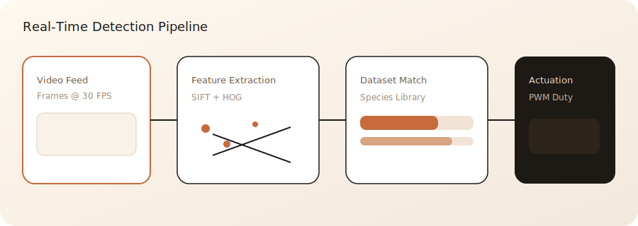
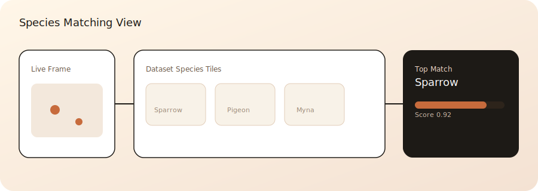
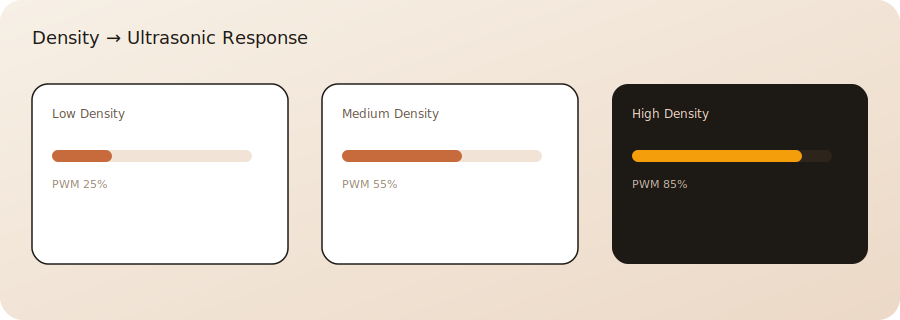

# SIFT + HOG Bird Detection & Ultrasonic Actuation


Real-time bird detection pipeline that fuses SIFT keypoints with HOG (Histogram of Oriented Gradients) descriptors. Live video frames are matched against a pre-existing dataset of bird species images, detection density is estimated over time, and an ultrasonic actuator array is controlled dynamically via PWM duty cycles. The system was validated in field conditions and published in a peer-reviewed conference paper.

## Screenshots





## Run Locally

### Frontend
```
npm install
npm run dev
```
Then open `http://127.0.0.1:5173`.

### Backend
```
python -m venv .venv
.venv\Scripts\activate
pip install -r backend\requirements.txt
python backend\main.py
```
Defaults to `http://127.0.0.1:8000` for API routes.

## What the System Actually Does

The detection pipeline fuses two complementary feature strategies:
- SIFT captures distinctive keypoints so the system can recognize birds under changes in scale, angle, and lighting.
- HOG captures edge direction distributions, which improves shape-based discrimination when keypoints are sparse or motion blur is present.

Each incoming frame is processed to extract SIFT and HOG descriptors, then compared against a labeled species dataset. The matching step scores similarity across species and aggregates detections over time to produce a density estimate. That density drives an actuator controller that scales ultrasonic output intensity rather than issuing static on/off triggers, improving responsiveness while reducing energy waste and wear on the transducers.

The project’s contributions include a combined SIFT + HOG matching strategy, a dataset-driven species comparison loop, and a density-aware actuation policy tuned for real-time deployment. The results and field evaluations were published in a peer-reviewed conference paper.
